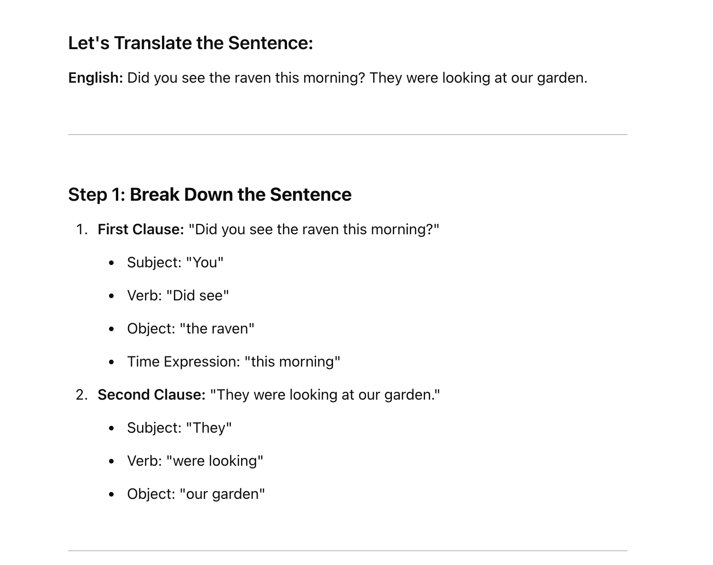
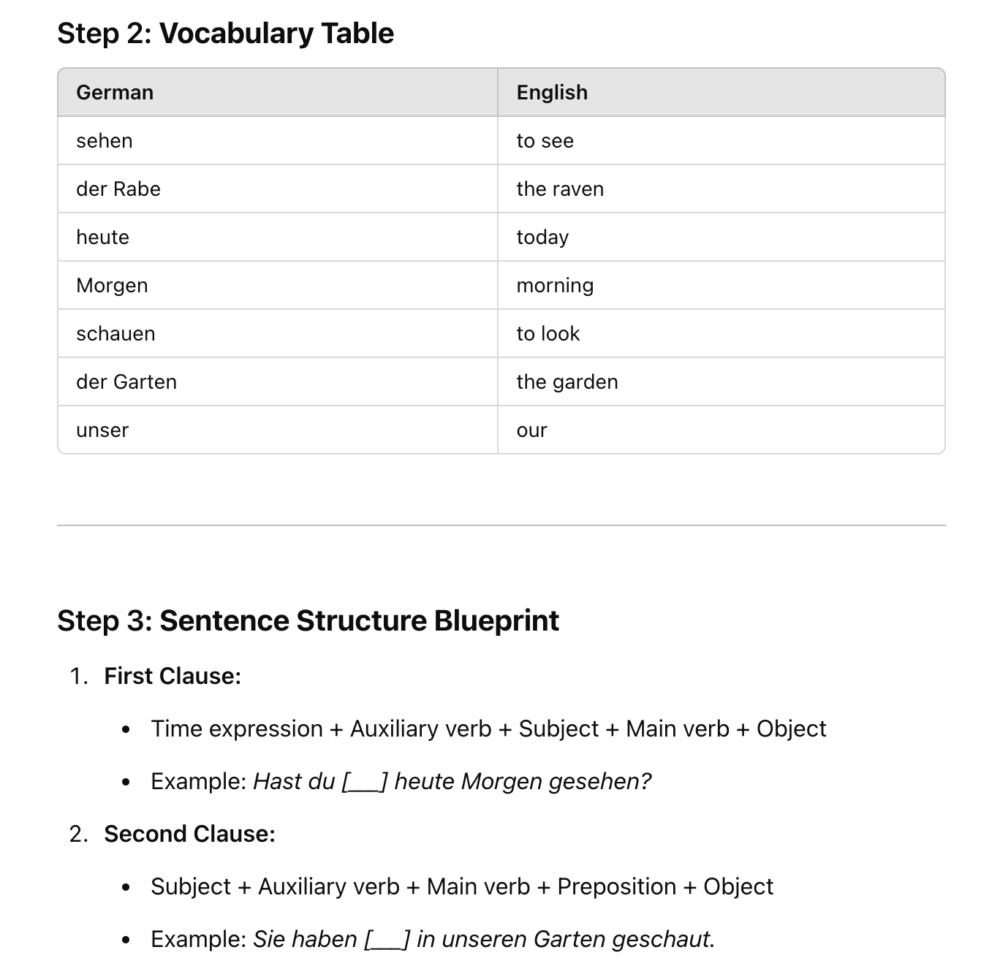
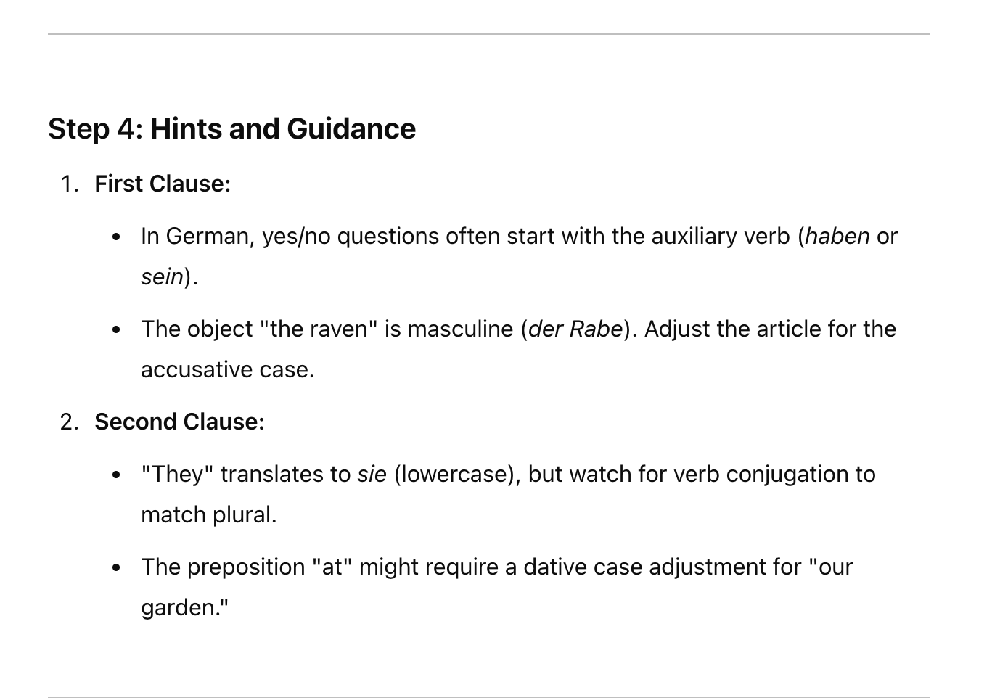
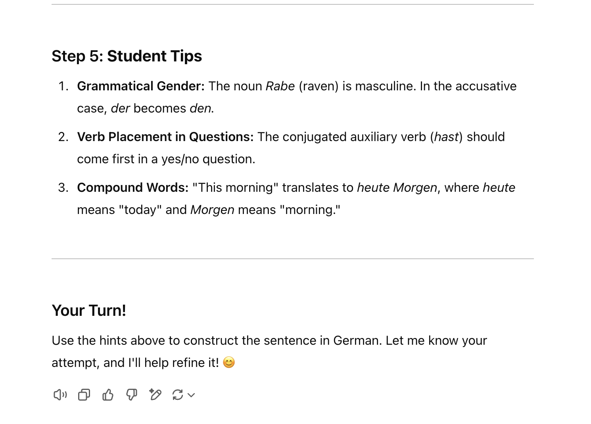

# ChatGPT Powered Assistant Guide

## Details

- Website is at [**ChatGPT**](https://chatgpt.com/).
- Free tier make use of the `GPT 4 Turbo Model`

> I don't have the paid version of ChatGPT, so I have to manage with the Turbo Version making use of what I have access to.

## Prompting Guides

OpenAI offers a document with possble guides for promt engineering their models. [Link](https://platform.openai.com/docs/guides/prompt-engineering)

Just like Meta AI there are no specific formatting to best provide context.

## Prompting Experience

- The Reason feature works a lot well when you want the model to take in a lot of information and for it to absorb it and then return it in a better and more concice format. I tested this by asking the model to make my prompt better without the reasoning and with the reasoning, the result gotten with reasoning was by far the better one.

  - **Results From new Prompt**
  
  
  
  